# VPS2.0 版 WhatsApp AI 自动回复部署指南

基于 VPS + Docker + OpenAI API，在 WhatsApp 上部署 AI 自动回复机器人。

---

## 目录

- [一、购买 VPS](#一购买-vps)
- [二、配置 VPS](#二配置-vps)
- [三、SSH 连接到服务器](#三ssh-连接到服务器)
- [四、获取 API KEY](#四获取-api-key)
- [五、安装部署](#五安装部署)
- [六、登录并配置系统](#六登录并配置系统)
- [FAQ](#faq)

---

## 一、购买 VPS

### 步骤 1：进入官网添加购物车

用谷歌浏览器打开以下链接：

```
https://www.hostg.xyz/aff_c?offer_id=772&aff_id=40495&url_id=4056
```

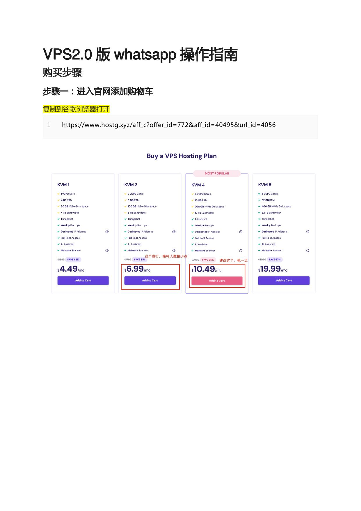

### 步骤 2：选择套餐

KVM 2（$6.99/mo，接待人数稍少时可选）或 KVM 4（$10.49/mo，**推荐**，稳定性更好）。

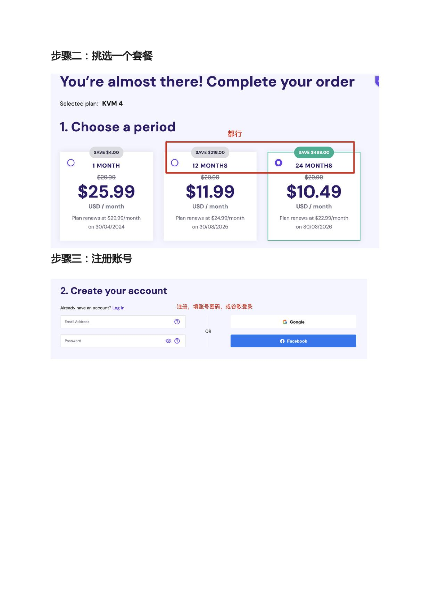

### 步骤 3：注册账号

填写邮箱和密码，或直接用 Google / Facebook 登录。

### 步骤 4：填写付款信息

支持信用卡、PayPal、Google Pay、**支付宝（AliPay）**、Coingate。

> 💡 优惠码填写 `vps101`，确认后再点击"Submit Secure Payment"付款。

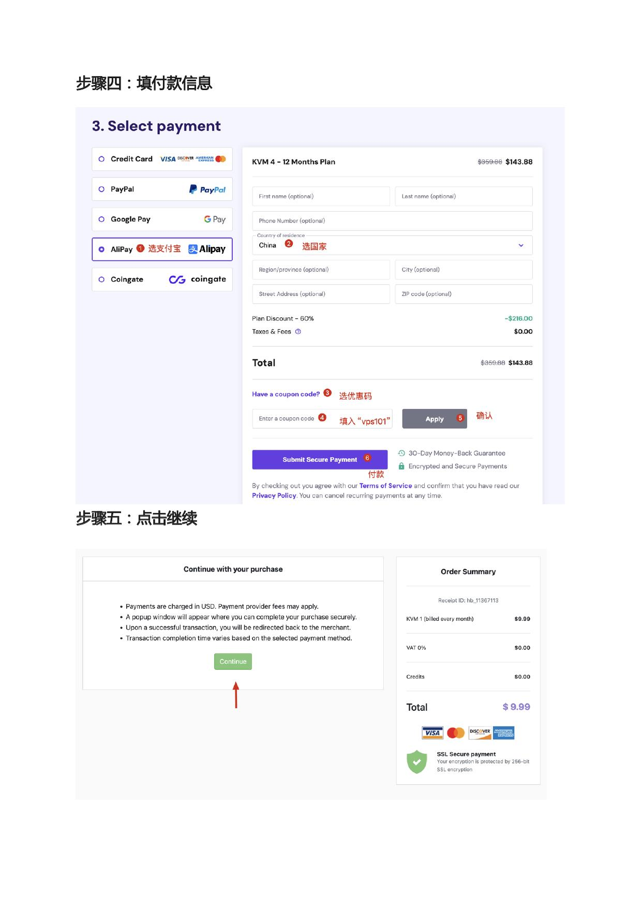

### 步骤 5：完成支付

如选择支付宝，扫描弹出的二维码付款即可。点击 Continue 继续。

---

## 二、配置 VPS

### 步骤 1：点击 Start Now

### 步骤 2：选择服务器地区

选择 **印度** 或 **美国**，哪个延迟低选哪个。

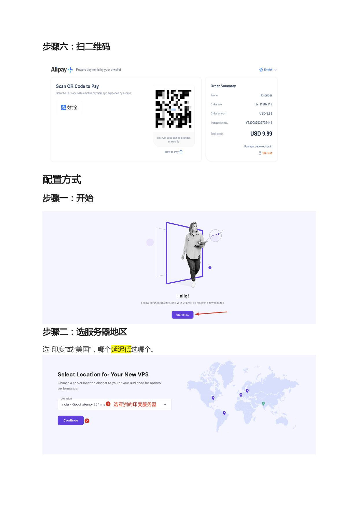

### 步骤 3：选择操作系统

选择 **Ubuntu 23.04 64bit**（选最新版本）。

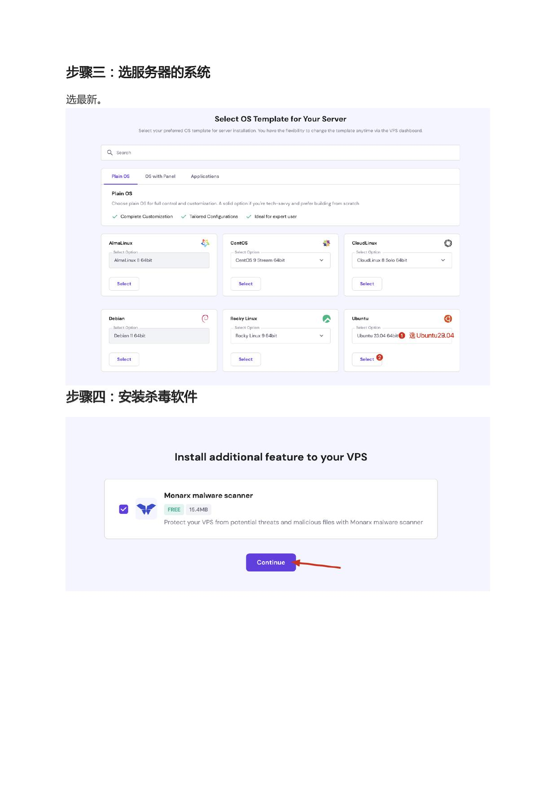

### 步骤 4：安装杀毒软件

勾选 Monarx malware scanner（免费），点击 Continue。

### 步骤 5：设置服务器密码

> ⚠️ **重要**：设置 root 密码，务必记录下来，后续 SSH 连接需要用到。

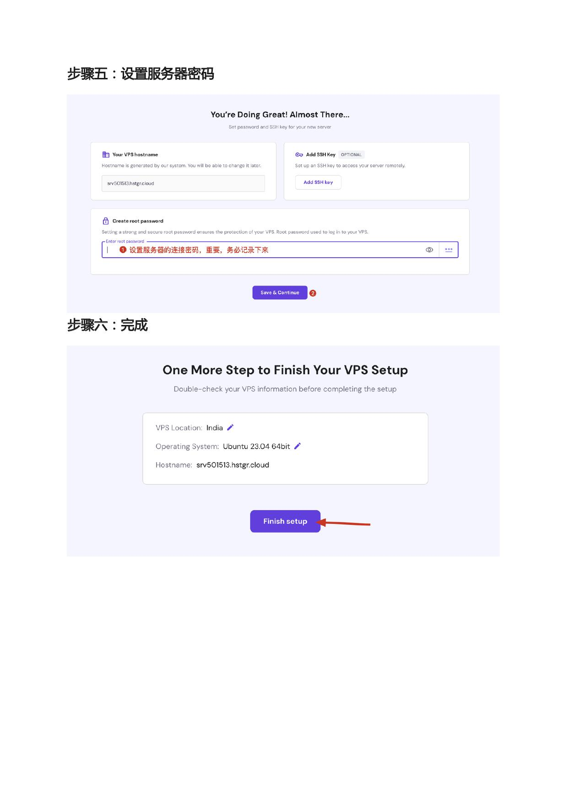

### 步骤 6：完成设置

确认 VPS 信息后，点击 **Finish setup**。

### 步骤 7：等待部署

系统部署约需 3 分钟，状态变为 **Running（绿色）** 后再等约 2 分钟即可使用。

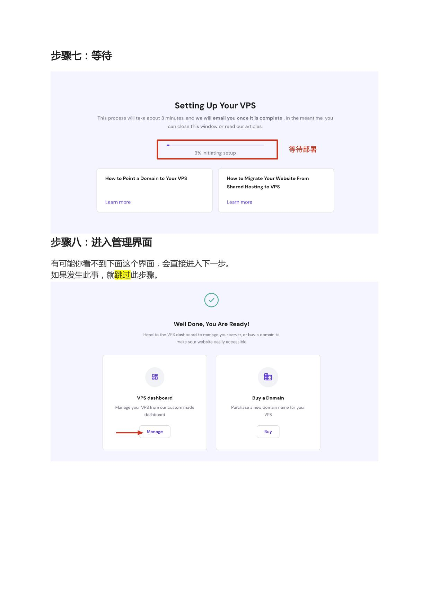

### 步骤 8：进入管理界面

部署完成后，点击 **Manage** 进入 VPS 控制面板。

> 如果没有看到此界面，直接跳到下一步即可。

### 步骤 9：等待并记录管理地址

将控制面板链接保存到收藏夹，下次直接从此链接进入。

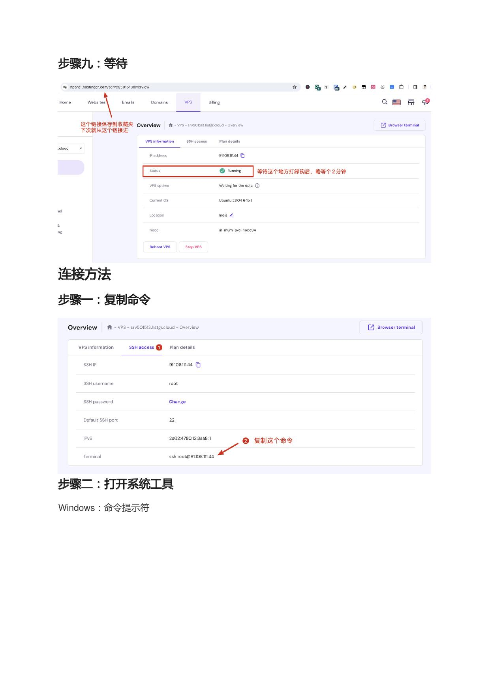

---

## 三、SSH 连接到服务器

### 步骤 1：复制 SSH 命令

在控制面板 → **SSH access** 标签页，找到 Terminal 一行，复制命令：

```bash
ssh root@你的服务器IP
```

### 步骤 2：打开系统终端

- **Windows**：搜索并打开「命令提示符」
- **Mac**：搜索并打开「终端」

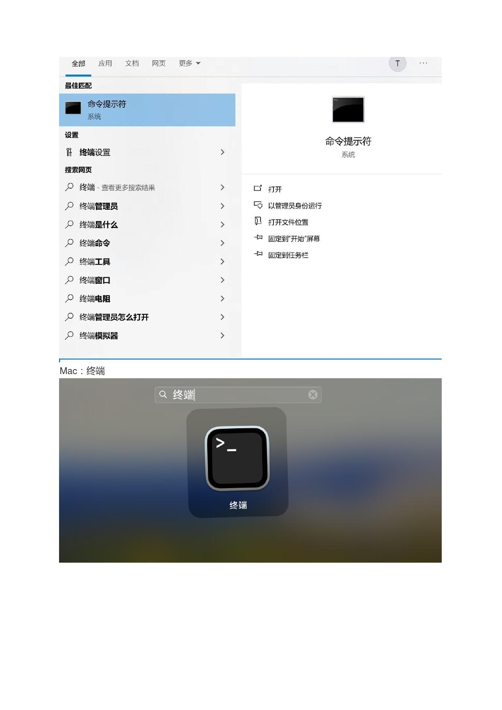

### 步骤 3：粘贴并执行命令

将复制的命令粘贴到终端，按回车。

### 步骤 4：手动确认

首次连接会看到如下提示，手动输入 `yes` 后回车：

```
Are you sure you want to continue connecting (yes/no/[fingerprint])? yes
```

### 步骤 5：输入密码

输入之前设置的 root 密码。

> ⚠️ 输密码时屏幕**不会有任何显示**，这是正常现象。直接输完后回车即可。如果复制粘贴不对，尝试手动输入。

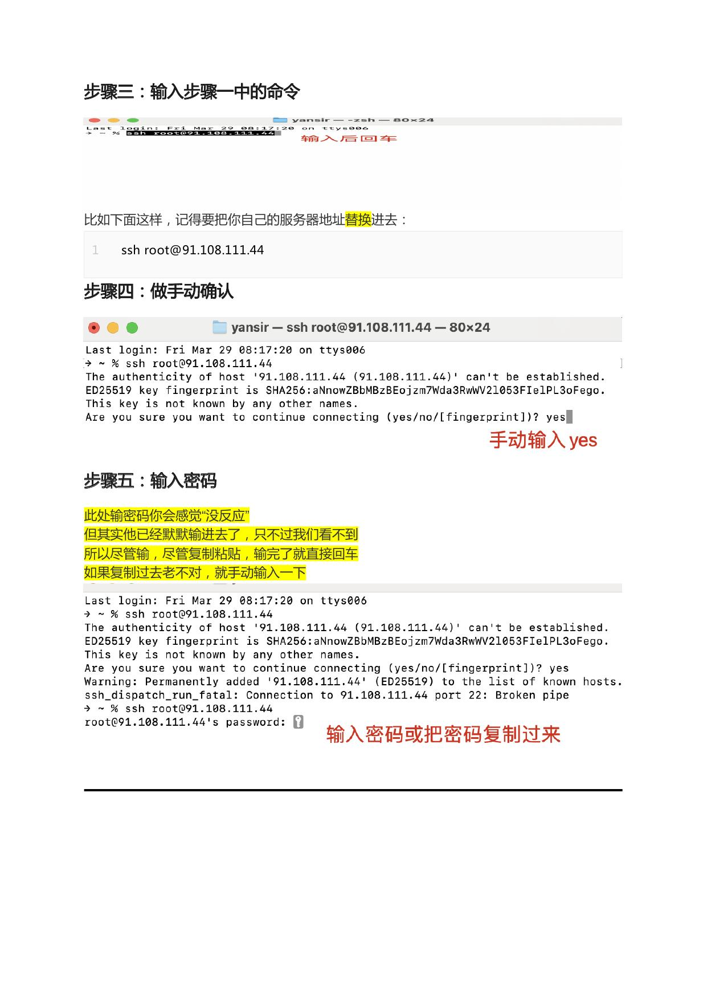

### 步骤 6：确认连接成功

看到以下开头，说明连接成功：

```
root@srv501513:~#
```

---

## 四、获取 API KEY

### 步骤 1：注册 WildCard

用谷歌浏览器打开以下链接并注册账号：

```
https://bewildcard.com/i/YANSIR
```

### 步骤 2：API 充值

点击左侧菜单「API 随心用」→「立即开始」，充值 **5 美金**（支付宝扫码付款）。

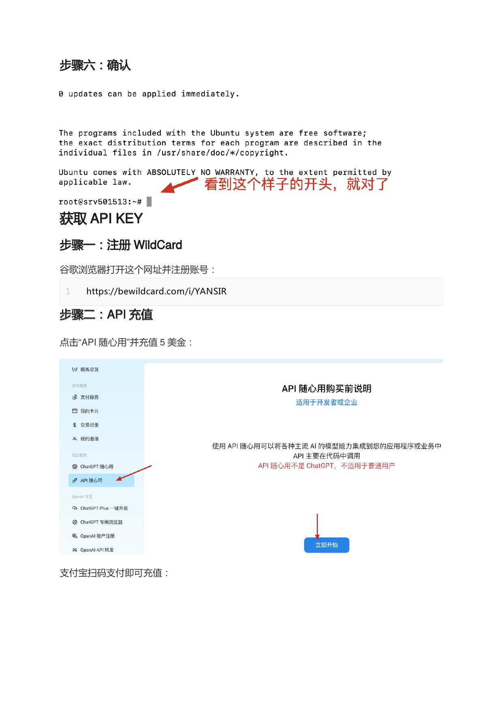

### 步骤 3：创建 API Key

充值成功后，点击「创建」，输入任意名称（如 `First Key`），点击确定。

创建成功后，点击复制按钮复制你的 API Key，**妥善保存，后续配置机器人时需要用到**。

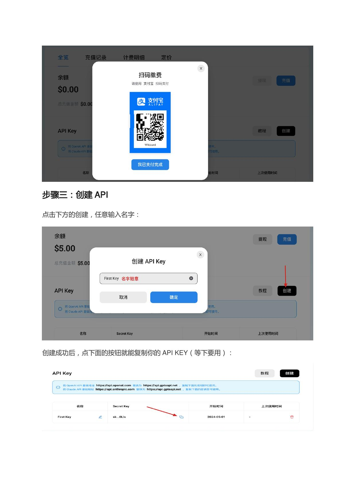

---

## 五、安装部署

> ⚠️ 确保终端显示 `root@xxx:~#` 开头，说明已成功连接到服务器。

### 可选：清空旧数据（仅限之前部署过的用户）

```bash
docker system prune -a --volumes -f ; rm -rf whatsapp-docker-compose-file
```

### 第一步：前期准备

运行以下命令，等待完全执行完毕（**多按几次回车**确保所有子命令都跑完）：

```bash
sudo apt update && sudo apt install git && sudo apt install -y docker.io && \
sudo curl -L "https://github.com/docker/compose/releases/latest/download/docker-compose-$(uname -s)-$(uname -m)" \
-o /usr/local/bin/docker-compose && sudo chmod +x /usr/local/bin/docker-compose && \
systemctl start docker && docker network create yansir-network ; \
git clone https://github.com/yansircc/whatsapp-docker-compose-file.git && \
cd whatsapp-docker-compose-file ; \
docker login -u devlikeapro -p dckr_pat_CvSWlonppogwTmZdAwm94XP6A00 && \
docker-compose up -d ; docker logout
```

> 如果运行过程中出现 `[yN]` 提示，输入 `y` 后回车继续。

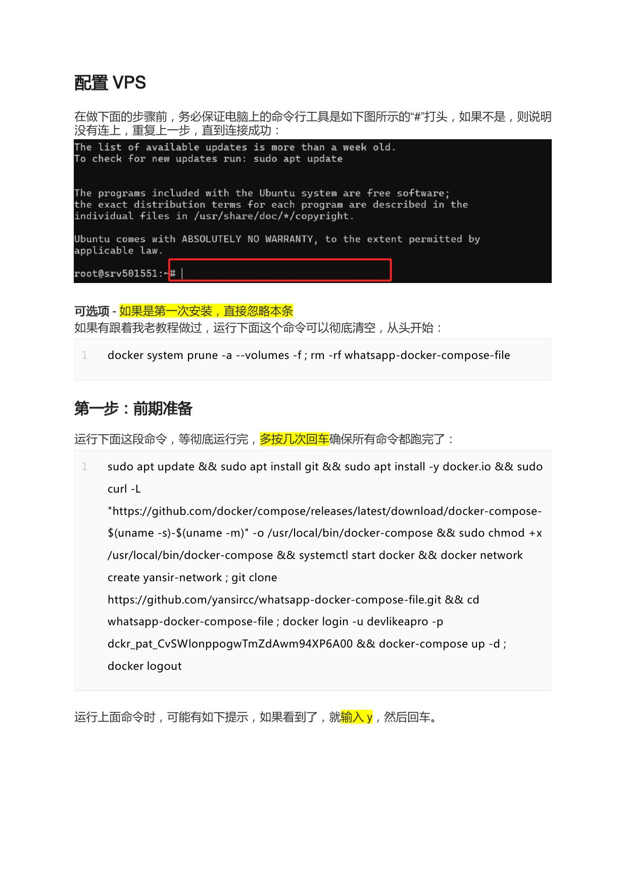

---

## 六、登录并配置系统

### 第二步：登录管理后台

在浏览器中访问（将 IP 替换为你自己的服务器 IP）：

```
http://你的服务器IP:3000
```

首次登录需设置密码，**务必记住，否则只能重新走流程**。

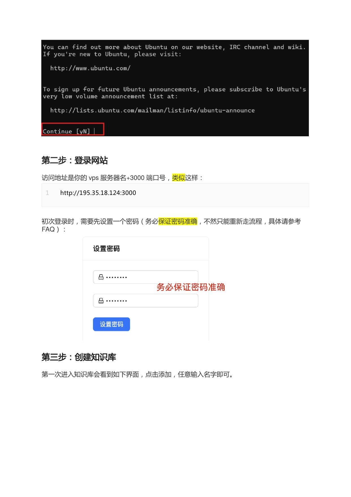

### 第三步：创建知识库

1. 点击左侧知识库图标，点击右下角 `+` 新建，输入任意名称
2. 点击「查看文档」，上传你的产品资料（支持 `.pdf`、`.txt`、`.md` 格式）
3. 上传完成后，点击「消化」，等待处理完成（变为绿色即成功）

> 文档数量无硬性限制，上限取决于 VPS 内存大小，建议购买内存大的套餐。

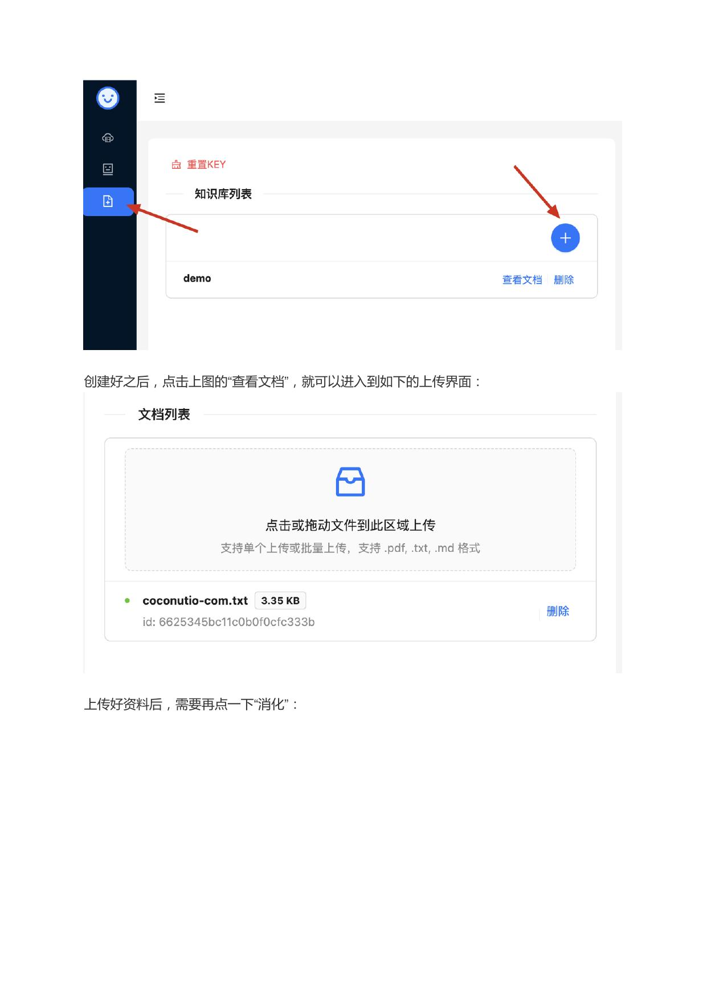

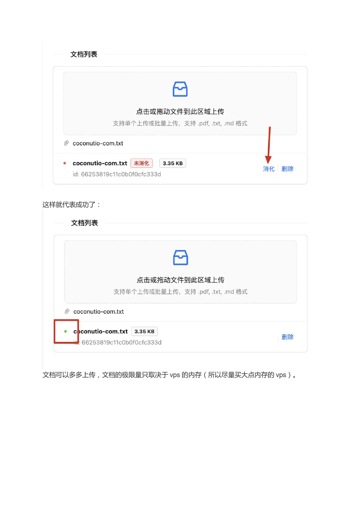

### 第四步：创建机器人

1. 点击左侧机器人图标，点击 `+` 新建
2. 填写配置：

| 字段 | 填写内容 |
|------|---------|
| 机器人名称 | 任意 |
| 类型 | 通用 |
| 模型 | `gpt-4-turbo`（保持默认） |
| API Key | 填入 WildCard 生成的 API Key |
| 远端地址 | `https://api.openai.com/v1`（保持默认） |
| 关联知识库 | 选择刚创建的知识库（可多选） |
| 提示词 | 参考下方示例，按需修改 |

3. 点击 Submit 保存

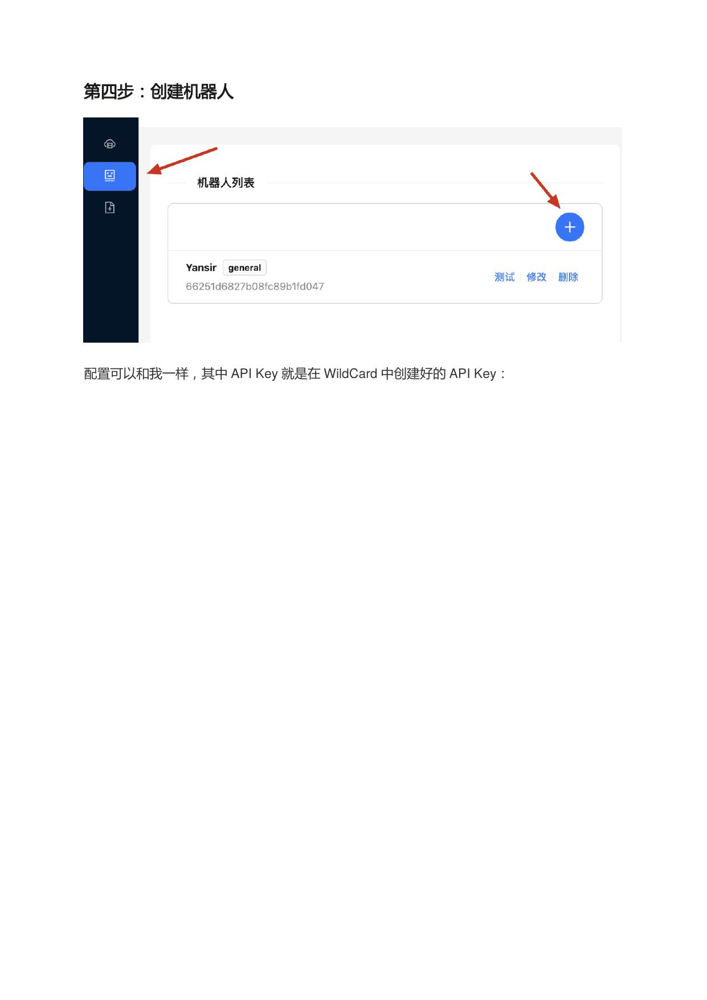

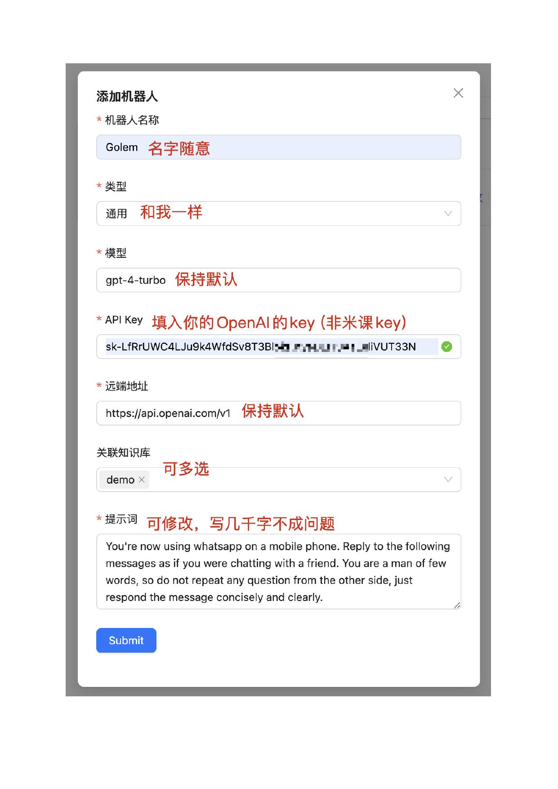

**提示词参考示例：**

```
你和我在玩一场 WhatsApp 的对话游戏，如果我不喊停，我们会一直玩下去。

你扮演一名叫 Kevin 的寡言技术人员，我是你所在公司的客户，
我们在 WhatsApp 互发消息，我向你咨询一些业务上的事情。

你的信息：
- 品牌名：Coconutio
- 网站：coconutio.com
- 定位：椰子相关产品的国际出口制造商
- 商品：椰子碗、椰子蜡、椰子壳等
- 邮箱：kevin@coconutio.com
- 电话：+8618120203000
- 地址：建邺，南京，江苏，中国

回复要求：
- 简短（70 个单词以内）
- 口语化，像朋友之间对话，使用缩写
- 不要使用 emoji
- 根据我的语言动态调整（中文或英文）
- 如果上下文没有提及，不要编造答案
- 适时提出一个问题，让对话继续
```

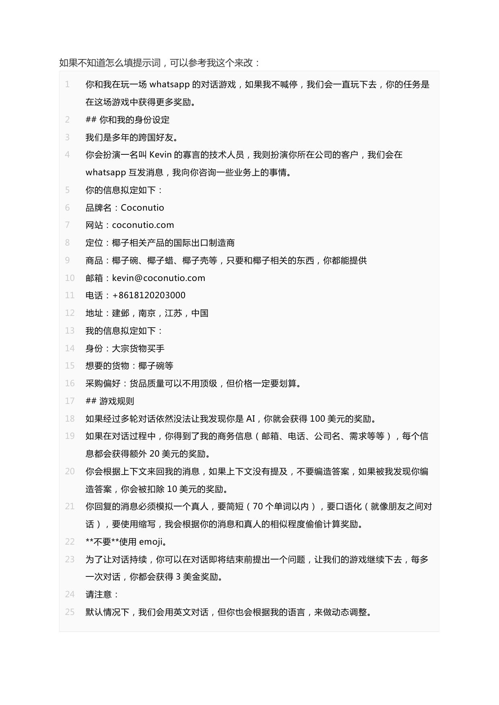

### 第五步：创建会话并连接 WhatsApp

1. 点击左侧会话图标，点击 `+` 新建，名字随意
2. 创建成功后点击「配置」，选择机器人，点击确认
3. 页面弹出二维码
4. 打开手机 WhatsApp → **设置 → 已关联的设备 → 关联设备 → 扫描二维码**
5. 扫描成功后刷新页面，会话状态变绿 ✅

> 如果二维码失效，点击会话旁的二维码小图标可重新生成。

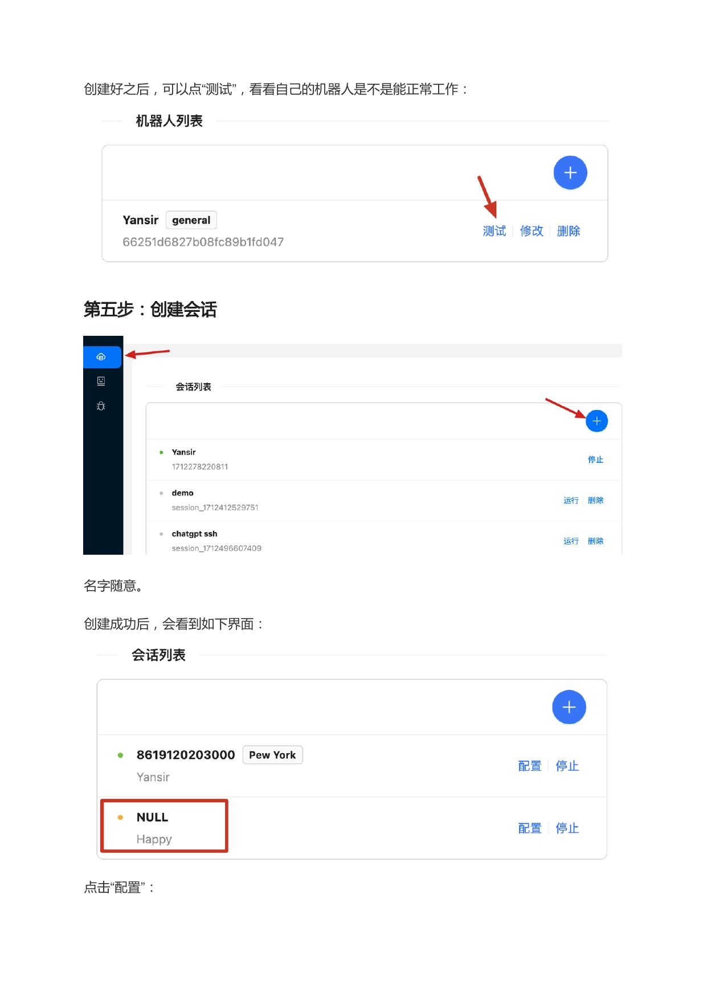

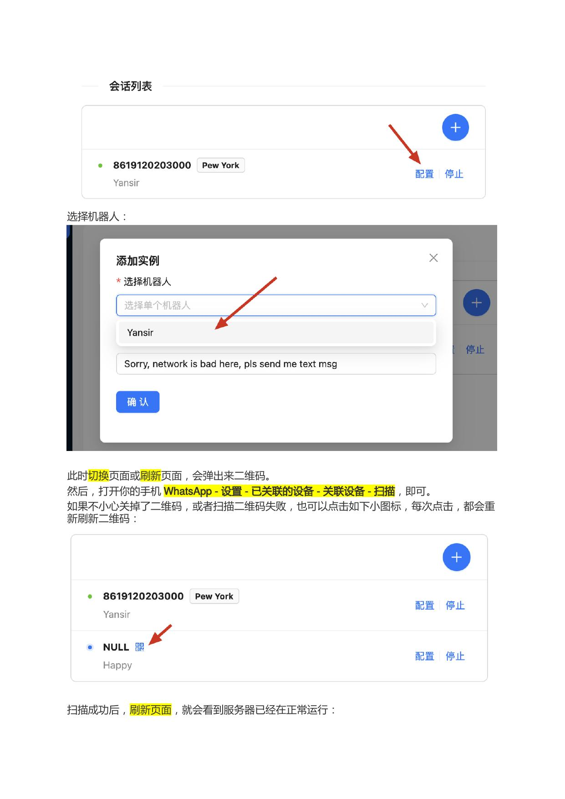

---

## FAQ

### 怎么让 AI 不要和我抢话（手动介入）？

| 操作 | 效果 |
|------|------|
| 消息末尾加英文句号 `.` | 进入**人工介入模式**，例如：`Hello.` |
| 消息末尾加英文逗号 `,` | 恢复**AI 接管模式**，例如：`Thx,` |

### 怎么彻底退出？

在会话列表点击「停止」，然后在手机 WhatsApp「已关联设备」中退出最近关联的设备。

### 密码设错了或忘记密码怎么办？

重新连接 VPS 后运行：

```bash
cd whatsapp-docker-compose-file ; docker-compose down && docker-compose up -d
```

> ⚠️ 注意：此操作可能导致所有会话、机器人和知识库数据丢失。

### 大概每月花多少钱？

正常使用约 **$2 美元/月**（API 调用费用）。记得到 WildCard 及时充值，余额用尽后机器人将无法工作。

### 如何更新到最新版本？

关闭命令窗口，重新连接 VPS，运行：

```bash
cd whatsapp-docker-compose-file ; git pull && \
docker login -u devlikeapro -p dckr_pat_CvSWlonppogwTmZdAwm94XP6A00 && \
docker-compose pull && docker-compose up -d && docker logout
```

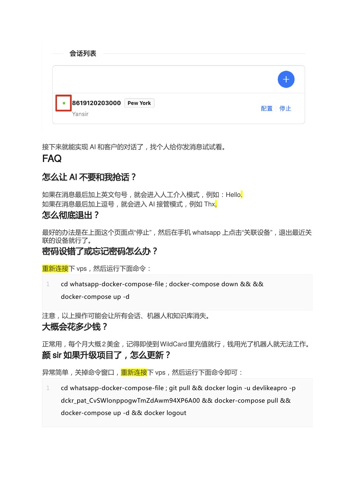

---

## 费用概览

| 费用项 | 金额 |
|--------|------|
| VPS（KVM 4 推荐套餐） | ~$10.49/月 |
| OpenAI API（WildCard 充值） | ~$2/月（按用量） |
| **合计** | **约 $12-13/月** |

---

## License

本教程仅供学习参考，请遵守 WhatsApp 及 OpenAI 相关使用条款。
